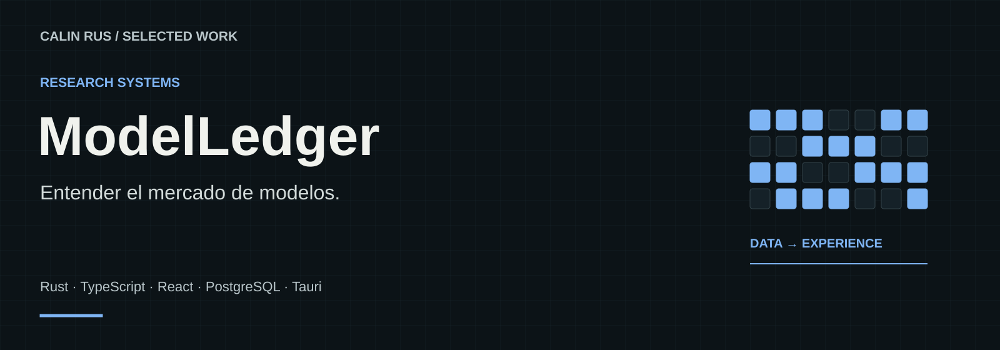
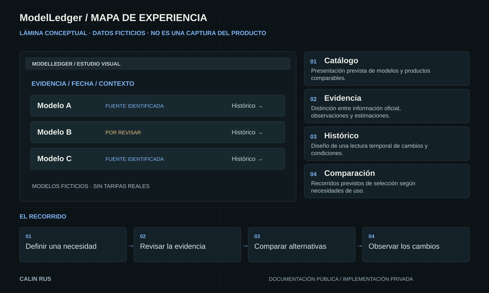

# ModelLedger

**Entender el mercado de modelos.**

Un proyecto de investigación para comparar modelos y planes de IA teniendo en cuenta fuentes, cambios históricos y contexto de uso.

**Stack:** Rust · TypeScript · React · PostgreSQL · Tauri  
**Estado:** Implementación V2 incompleta

[Portfolio](https://github.com/calinrus-dev/portfolio) · [Experiencia](docs/EXPERIENCIA.md) · [Componentes](docs/COMPONENTES.md) · [Diseño técnico](docs/ARQUITECTURA.md) · [Demostraciones](docs/DEMOSTRACIONES.md) · [Estado](docs/ESTADO.md)

## El problema que aborda

Un precio aislado no explica un producto: cambian los límites, las condiciones y las fuentes. ModelLedger explora una forma de organizar esa evidencia y hacer explícita su incertidumbre.

## Qué compone la experiencia

- **Catálogo.** Presentación prevista de modelos y productos comparables.
- **Evidencia.** Distinción entre información oficial, observaciones y estimaciones.
- **Histórico.** Diseño de una lectura temporal de cambios y condiciones.
- **Comparación.** Recorridos previstos de selección según necesidades de uso.

*Lámina explicativa con datos ficticios. Su contenido también está disponible como texto en [Componentes](docs/COMPONENTES.md).*

## Decisiones que definen el proyecto

- **La procedencia acompaña al dato.** Una afirmación necesita contexto y fecha para poder interpretarse.
- **Incertidumbre visible.** Un valor desconocido no se convierte en cero ni en una promesa.
- **El estado real se publica.** La implementación parcial se presenta como tal y no como una plataforma disponible.

## Explorar el caso

- [Experiencia y recorrido](docs/EXPERIENCIA.md): intención, interacción y criterios de revisión.
- [Componentes](docs/COMPONENTES.md): las piezas visibles y el papel de cada una.
- [Diseño técnico](docs/ARQUITECTURA.md): responsabilidades y compromisos de diseño.
- [Demostraciones](docs/DEMOSTRACIONES.md): qué enseñan las imágenes y cómo leer la evidencia.
- [Estado y siguientes pasos](docs/ESTADO.md): alcance actual, comprobaciones y trabajo pendiente.

## Sobre este repositorio

Caso de estudio público de un proyecto con implementación privada. Reúne documentación, diagramas e imágenes seleccionadas. El motor, las integraciones y los datos operativos se mantienen privados. Las piezas públicas seleccionadas indican su origen y alcance.

Revisión editorial: 28 de septiembre de 2026. Autor: [Calin Rus](https://github.com/calinrus-dev).

[Instagram @c4linrus](https://www.instagram.com/c4linrus/) · [LinkedIn / calinrus](https://www.linkedin.com/in/calinrus/) · [Todos los proyectos](https://github.com/calinrus-dev/portfolio)
