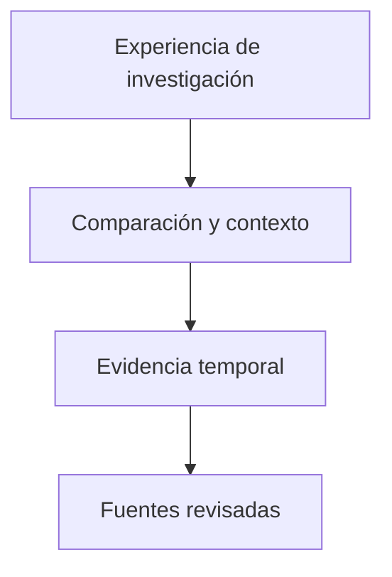

# ModelLedger / Diseño técnico

[← Inicio](../README.md)

## Contexto

Un proyecto de investigación para comparar modelos y planes de IA teniendo en cuenta fuentes, cambios históricos y contexto de uso.

**Tecnologías asociadas al proyecto:** Rust · TypeScript · React · PostgreSQL · Tauri.

## Mapa de responsabilidades

Este mapa conceptual organiza la explicación del producto; no representa endpoints, procesos desplegados ni contratos internos.

## La procedencia acompaña al dato

Una afirmación necesita contexto y fecha para poder interpretarse.

## Incertidumbre visible

Un valor desconocido no se convierte en cero ni en una promesa.

## El estado real se publica

La implementación parcial se presenta como tal y no como una plataforma disponible.

## Rendimiento y dependencia

Mi criterio de trabajo es medir antes de optimizar: identificar el recorrido relevante, observar tiempo de respuesta y uso de recursos y comparar cambios con la misma carga. En sistemas nativos también me interesa la disposición de datos, la localidad de memoria y el trabajo repetido.

Local-first es una preferencia arquitectónica: conservar una experiencia útil y control sobre los datos en el dispositivo, e incorporar servicios externos cuando aporten una función concreta. Su alcance varía por proyecto; no implica que todas las integraciones de este caso funcionen sin conexión.

No se publican cifras de rendimiento sin un ensayo identificado. La evidencia específica disponible está en [Estado](ESTADO.md).

## Qué conviene demostrar después

- Cerrar la integración de interfaz y navegación.
- Validar persistencia y revisión de evidencia.
- Preparar una demostración completa con un conjunto de datos controlado.
